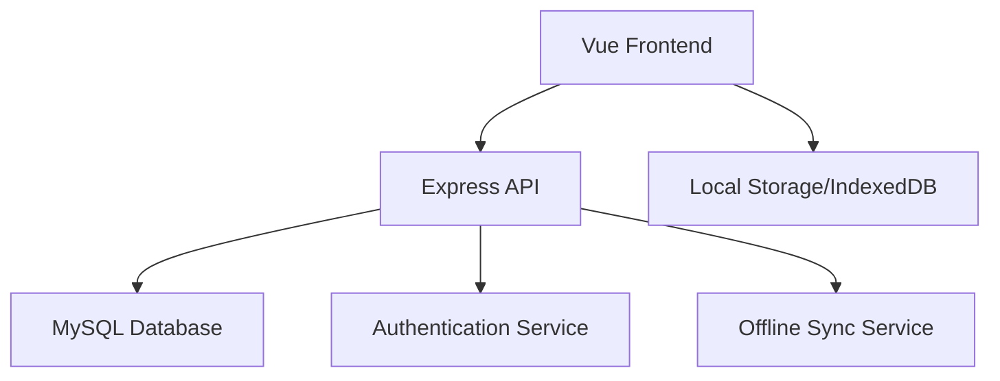
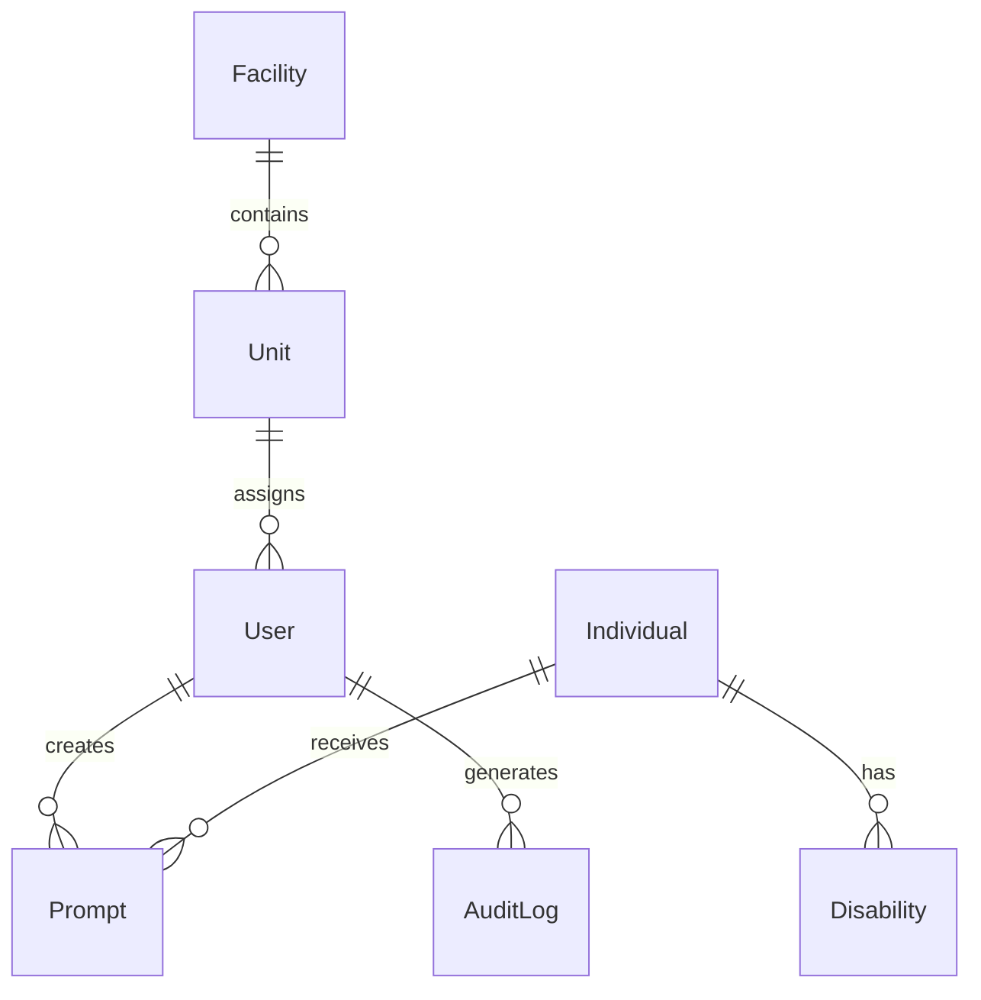

# CAMU ECOA App System Patterns

## Architecture Overview

### Technology Stack
- Frontend: Vue 3 + Vuetify
- Backend: Node.js + Express
- Database: MySQL + Prisma ORM
- Authentication: JWT + bcrypt
- Testing: Jest

### System Components

## Design Patterns

### Frontend Patterns

#### Component Architecture
- Atomic Design methodology
- Composition API for state management
- Vuex for global state
- Vue Router for navigation

#### Offline Support
- Service Workers for caching
- IndexedDB for local storage
- Queue system for pending operations
- Sync status indicators

### Backend Patterns

#### API Design
- RESTful endpoints
- JWT authentication
- Role-based access control
- Request validation middleware
- Error handling middleware

#### Database Patterns
- Prisma for type-safe queries
- Migration-based schema management
- Soft deletes for data retention
- Audit logging for changes
- Indexing for performance
- JSON column type for metadata
- Transaction support for data integrity
- Connection pooling optimization

## Data Models

### Core Models
1. User
2. Individual
3. Disability
4. Prompt
5. MemoryBank
6. Facility
7. Unit
8. AuditLog

### Relationships

## Security Patterns

### Authentication
1. JWT-based token system
2. Refresh token rotation
3. Password hashing with bcrypt
4. Role-based permissions
5. Session management

### Data Security
1. Encryption at rest
2. TLS for data in transit
3. Input validation
4. SQL injection prevention
5. XSS protection

## Offline Patterns

### Data Synchronization
1. Queue-based sync system
2. Conflict resolution
3. Version tracking
4. Retry mechanism
5. Status tracking

### Local Storage
1. IndexedDB for data
2. Cache for static assets
3. Queue for pending operations
4. Status indicators
5. Data cleanup

## Error Handling

### Frontend Errors
1. Network error recovery
2. Validation feedback
3. Offline mode indicators
4. User notifications
5. Error boundaries

### Backend Errors
1. Global error handler
2. Structured error responses
3. Error logging
4. Retry mechanisms
5. Fallback strategies

## Performance Patterns

### Frontend Performance
1. Code splitting
2. Lazy loading
3. Asset optimization
4. Cache management
5. Bundle size optimization

### Backend Performance
1. Query optimization
2. Connection pooling
3. Caching strategies
4. Rate limiting
5. Load balancing

## Testing Patterns

### Test Types
1. Unit tests
2. Integration tests
3. E2E tests
4. Performance tests
5. Security tests

### Test Implementation
1. Jest for unit testing
2. Cypress for E2E
3. Supertest for API testing
4. Mock services
5. Test data factories

## Deployment Patterns

### CI/CD Pipeline
1. Automated testing
2. Code quality checks
3. Security scanning
4. Automated deployment
5. Environment management

### Monitoring
1. Error tracking
2. Performance monitoring
3. Usage analytics
4. Audit logging
5. Health checks

#### Local Deployment Automation
- Updated deploy-changes.sh script:
  - Auto-detects Minikube Docker context
  - Uses correct build contexts for frontend, backend, and mysql
  - Skips build for monitoring images (Loki, Promtail, Grafana, Prometheus)
  - Applies manifests and restarts pods/daemonsets as needed
  - Documents troubleshooting for image pulls and CA certs 